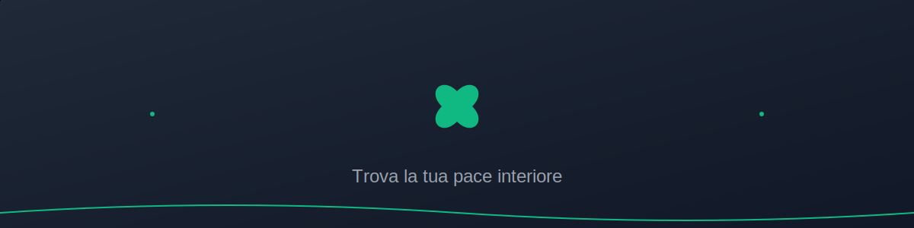

# 🧘 Meditation App

<div align="center" class="banner-container">



Una moderna applicazione web per la meditazione e il rilassamento, progettata per aiutarti a trovare la tua pace interiore.

[](https://choosealicense.com/licenses/mit/)
[](https://reactjs.org/)
[](https://tailwindcss.com/)

[Demo Live](https://your-demo-link.com) | [Segnala Bug](https://github.com/MaxPopovschii/my-meditation-app/issues) | [Richiedi Feature](https://github.com/MaxPopovschii/my-meditation-app/issues)

</div>

## ✨ Caratteristiche Principali

- 🎵 **Suoni Ambientali**
  - Miscelatore di suoni naturali
  - Controllo volume individuale
  - Loop continuo perfetto
  
- ⏲️ **Timer di Meditazione**
  - Timer personalizzabile
  - Preset predefiniti
  - Notifiche sonore
  
- 🧘‍♂️ **Meditazioni Guidate**
  - Collezione di meditazioni
  - Diverse durate e temi
  - Guide professionali
  
- 🎨 **Design Moderno**
  - Interfaccia intuitiva
  - Completamente responsive
  - Animazioni fluide
  - Tema scuro ottimizzato

## 🚀 Demo


## 💻 Tecnologie Utilizzate

- **Frontend**
  - React 18
  - Tailwind CSS
  - React Router v6
  - React Icons
  
- **Audio**
  - Web Audio API
  - HTML5 Audio
  
- **Performance**
  - React Suspense
  - Lazy Loading
  - Asset Optimization

## 🛠️ Installazione

1. **Clona il repository**
```bash
git clone https://github.com/MaxPopovschii/my-meditation-app.git
```

2. **Installa le dipendenze**
```bash
cd my-meditation-app
npm install
```

3. **Configura le variabili d'ambiente**
```bash
cp .env.example .env
```

4. **Avvia l'applicazione**
```bash
npm start
```

L'app sarà disponibile all'indirizzo `http://localhost:3000`

## 📱 Screenshot

<div align="center">
  
  
  
  
</div>

## 🤝 Come Contribuire

I contributi sono sempre benvenuti! Per favore, segui questi passaggi:

1. Forka il progetto
2. Crea il tuo Feature Branch (`git checkout -b feature/AmazingFeature`)
3. Committa i tuoi cambiamenti (`git commit -m 'Add some AmazingFeature'`)
4. Pusha sul Branch (`git push origin feature/AmazingFeature`)
5. Apri una Pull Request

## 📝 Licenza

Distribuito sotto licenza MIT. Vedi `LICENSE` per maggiori informazioni.

## 👤 Autore

**Maxim Popovschii**

- Github: [@MaxPopovschii](https://github.com/MaxPopovschii)
- LinkedIn: [@maxim-popovschii](https://linkedin.com/in/maxim-popovschii)

## ⭐️ Mostra il tuo supporto

Se questo progetto ti è stato utile, lascia una ⭐️!

---

<div align="center">
  Made with ❤️ by Maxim Popovschii
</div>
